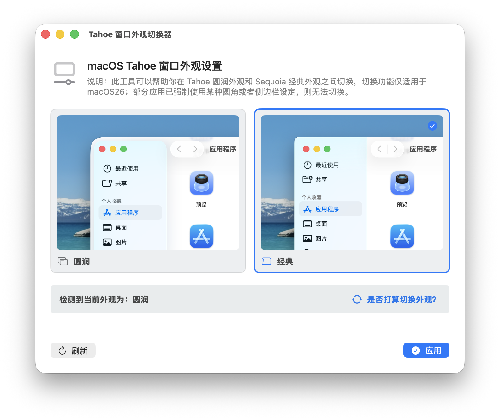

# macOS 26 窗口外观切换器

一个用于切换 macOS Tahoe 窗口外观的小工具。它提供图形界面，可以在 Tahoe 圆润外观和 Sequoia 经典外观之间切换，经典样式可以为你带来相对统一的圆角和更一体的侧边栏。

> 说明：
> 切换功能仅适用于 macOS 26 Tahoe。
> 部分应用如果已经强制使用自己的窗口圆角或侧边栏样式，可能不会跟随此设置变化，例如音乐、播客等。



## 功能

- 检测当前全局窗口外观设置
- 切换到 Tahoe 圆润外观
- 切换到 Sequoia 经典外观
- 应用设置后自动重启 Finder
- 提供两种外观的预览图
- 支持键盘控制，使用`TAB`切换样式，`ENTER`确认样式

## 系统要求

- macOS 26 或更高版本
- **注意：本项目未在 macOS 27 beta 进行测试**

## 项目结构

```text
.
├── Package.swift
├── Resources/
│   ├── AppIcon.icns
│   ├── AppearanceRounded.png
│   └── AppearanceClassic.png
├── Sources/AppearanceSwitcher/
│   ├── App/
│   ├── Models/
│   ├── Services/
│   ├── Stores/
│   ├── Support/
│   └── Views/
└── script/
    └── build_and_run.sh
```

## 运行

直接编译、打包并启动应用：

```bash
./script/build_and_run.sh
```

脚本会执行以下操作：

- 使用 `swift build` 编译 `Tahoe 窗口外观切换器`
- 在 `dist/Tahoe 窗口外观切换器.app` 生成应用包
- 复制图标和预览图资源
- 使用 ad-hoc 签名进行本地签名
- 启动应用

## 打包

只生成 `.app`，不自动启动：

```bash
./script/build_and_run.sh package
```

生成路径：

```text
dist/Tahoe 窗口外观切换器.app
```

## 调试

使用 LLDB 启动：

```bash
./script/build_and_run.sh debug
```

查看应用日志：

```bash
./script/build_and_run.sh logs
```

验证应用是否能启动：

```bash
./script/build_and_run.sh verify
```

## 实现原理

应用通过 `/usr/bin/defaults` 读写全局外观相关设置：

- `NSConvolutionOverride1`
- `NSSplitViewItemGlassMinimumCornerRadius`
- `NSSplitViewItemSidebarDefaultsToFloatingAppearance`

切换到经典外观时会写入预设值：

```text
NSConvolutionOverride1 = 9
NSSplitViewItemGlassMinimumCornerRadius = 6
NSSplitViewItemSidebarDefaultsToFloatingAppearance = false
```

切换到圆润外观时会删除这些全局覆盖项，让系统回到默认外观。

应用设置后会执行：

```bash
killall Finder
```

Finder 会由系统自动重新启动。其他已经运行的应用可能需要手动重启后才会读取新的外观设置。

## 注意事项

- 应用设置会修改当前用户的全局 `defaults -g` 配置。
- 应用切换外观前会提示保存工作，因为 Finder 会被重新启动。
- 如果当前系统设置不符合工具内置的圆润或经典预设，界面会显示为自定义外观。
- 本项目当前使用本地 ad-hoc 签名，未包含正式分发所需的开发者证书、公证或安装包流程。

## 手动恢复

如果需要在终端中手动恢复系统默认外观，可以执行：

```bash
defaults delete -g NSConvolutionOverride1
defaults delete -g NSSplitViewItemGlassMinimumCornerRadius
defaults delete -g NSSplitViewItemSidebarDefaultsToFloatingAppearance
killall Finder
```

如果某个键不存在，`defaults delete` 可能会输出错误，这是正常情况。

## 许可证

本项目使用 MIT License 开源，详见 [LICENSE](LICENSE)。

## TODO

- [x] 添加键盘控制绑定
- [ ] 添加控制中心按钮
- [ ] 添加窗口圆角自定义选项UI
- [ ] 设计一个更好看的图标，而不是这个AI生成的

## 参考

本项目灵感来自[nfzerox/launchbad-revived](https://github.com/nfzerox/launchbad-revived)，这个项目提供了在macOS26恢复启动台甚至完全去掉liquid glass效果的方法。
